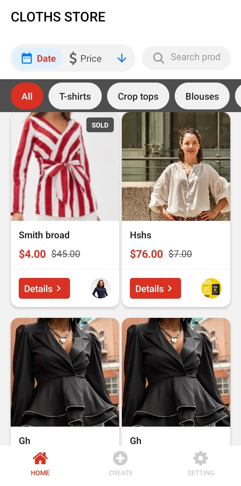
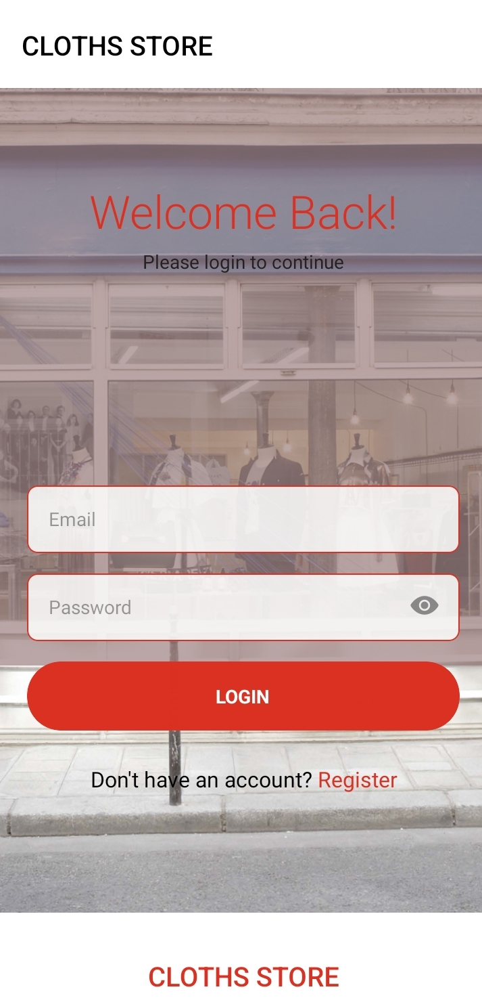
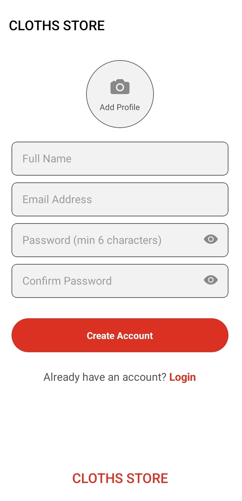
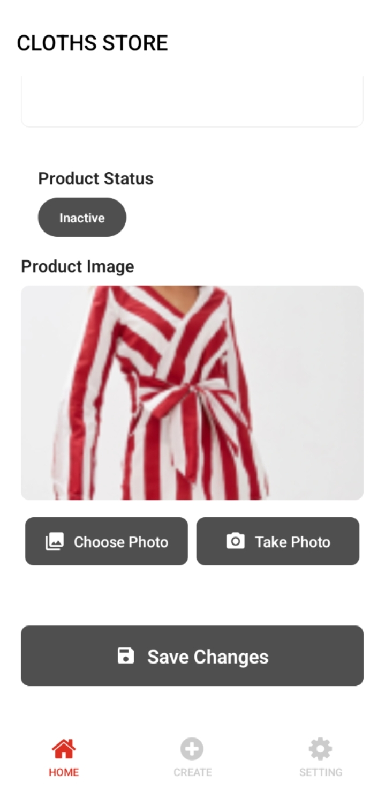

# Installation

Follow these steps to set up and run the project locally:

## 1. Install Project Dependencies

```bash
yarn install
```

Installs all the required packages defined in `package.json`.

## 2. Start the Development Server

```bash
yarn start
```

Launches the Expo development server.

## 3. Install Core Dependencies

### Expo

```bash
yarn add expo
```

Install the [Expo SDK](https://docs.expo.dev/).

### Redux and React Redux

```bash
yarn add redux react-redux
```

State management using [Redux](https://redux.js.org/) and [React Redux](https://react-redux.js.org/).

### TypeScript Types for React Redux

```bash
yarn add -D @types/react-redux
```

Provides [TypeScript definitions](https://github.com/DefinitelyTyped/DefinitelyTyped/tree/master/types/react-redux) for `react-redux`.

### Navigation Dependencies

```bash
npx expo install react-native-screens react-native-safe-area-context
```

Required by [React Navigation](https://reactnavigation.org/).

### Password Hashing

```bash
yarn add react-native-bcrypt
```

Provides support for password hashing. See [react-native-bcrypt on GitHub](https://github.com/RobinBobin/react-native-bcrypt).

### Image Picker

```bash
npx expo install expo-image-picker
```

Allows users to pick images from their device. See [Expo Image Picker documentation](https://docs.expo.dev/versions/latest/sdk/imagepicker/).

---

# Screenshots

Visual preview of the application's major screens:

### Home Page



### Login Page



### Register Page



### Profile Page


### Create Product


### Update Product



### Product Details


